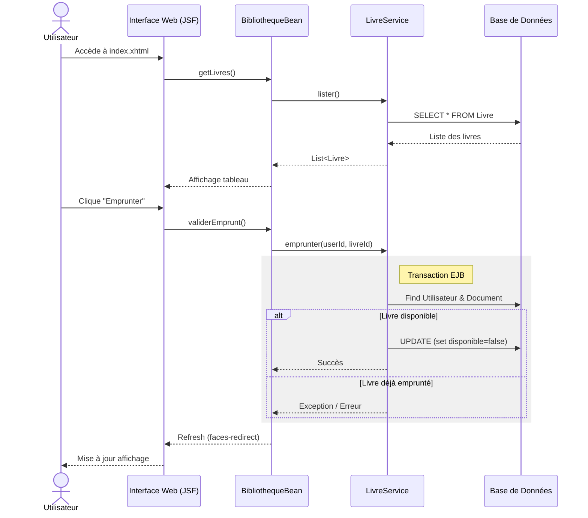

# Bibliouni2 - Application de Gestion de Bibliothèque Universitaire

Bienvenue dans le projet **Bibliouni2**, une application Java EE moderne conçue pour la gestion des emprunts de livres dans une bibliothèque universitaire.

Ce projet est structuré en modules Maven distincts pour assurer une séparation claire entre la logique métier ("Domain") et la couche de présentation/service ("WebSrv"). Il utilise des technologies standards telles que **JPA (Jakarta Persistence)**, **EJB (Enterprise JavaBeans)**, **JSF (Jakarta Server Faces)**, et **JAX-RS**.

## 🏗 Architecture du Projet

L'application suit une architecture multicouche classique. Voici un schéma illustrant les interactions entre les différents composants :

```mermaid
graph TD
    subgraph "Client"
        Browser[Navigateur Web]
        API_Client[Client API REST]
    end

    subgraph "Module: webSrv (Web & Services)"
        JSF[JSF Pages (index.xhtml)]
        Resource[JAX-RS Resource (BibliothequeService)]
        Init[DatabaseInitializer (Startup EJB)]
        
        subgraph "Backing Bean"
            Bean[BibliothequeBean]
        end
    end

    subgraph "Module: domain (Business Logic)"
        ServiceL[LivreService (EJB Stateless)]
        ServiceU[UtilisateurService (EJB Stateless)]
        
        subgraph "Entités JPA"
            Livre(Livre)
            Utilisateur(Utilisateur)
            Document(Document)
        end
    end

    subgraph "Persistance"
        DB[(Base de Données SQLite)]
    end

    Browser -- Requêtes HTTP --> JSF
    API_Client -- JSON --> Resource
    
    JSF -- Actions --> Bean
    Bean -- Appelle --> ServiceL
    Bean -- Appelle --> ServiceU
    Resource -- Appelle --> ServiceL
    
    Init -- Initialise --> ServiceL
    
    ServiceL -- CRUD --> Livre
    ServiceU -- CRUD --> Utilisateur
    
    Livre -. Mapping ORM .-> DB
    Utilisateur -. Mapping ORM .-> DB
    Document -. Mapping ORM .-> DB
```

---

## 📂 Contenu et Utilité des Fichiers

Le projet est désormais un **module unique**. Toutes les sources sont situées dans `src/main/java/com/libraryapp`.

### 📦 Composants Principaux

| Fichier | Type | Description |
| :--- | :--- | :--- |
| **`com.libraryapp.Document`** | Entity (JPA) | **Classe Mère**. Représente un document générique dans la bibliothèque. Gère les propriétés communes comme le titre, la disponibilité et l'emprunteur actuel. |
| **`com.libraryapp.Livre`** | Entity (JPA) | **Entité**. Hérite de `Document`. Ajoute des attributs spécifiques aux livres, comme l'auteur. |
| **`com.libraryapp.Utilisateur`** | Entity (JPA) | **Entité**. Représente un usager de la bibliothèque. Contient une liste de documents empruntés. |
| **`com.libraryapp.LivreService`** | EJB (Stateless) | **Service Métier**. Contient la logique transactionnelle pour les livres (CRUD, emprunt, retour). |
| **`com.libraryapp.UtilisateurService`** | EJB (Stateless) | **Service Métier**. Gère les opérations CRUD pour les utilisateurs. |
| **`com.libraryapp.websrv.BibliothequeBean`** | CDI Bean | **Contrôleur (Backing Bean)**. Fait le lien entre les pages JSF (`index.xhtml`) et les services métier. |
| **`com.libraryapp.websrv.BibliothequeService`** | JAX-RS Resource | **API REST**. Expose les données de la bibliothèque via des endpoints HTTP (JSON). |
| **`com.libraryapp.websrv.DatabaseInitializer`** | EJB (Startup) | **Initialisation**. Peuple la base de données au démarrage si elle est vide. |
| **`META-INF/persistence.xml`** | Config | Configuration JPA (connexion Base de Données). |
| **`WEB-INF/web.xml`** | Config | Descripteur de déploiement Web. |

---

## 🚀 Comment ça marche ?

1.  **Au Démarrage** : Le serveur d'application (ex: Wildfly, Glassfish) déploie l'application. `DatabaseInitializer` se lance et peuple la base de données SQLite si nécessaire.
2.  **Flux d'Exécution (Emprunt d'un Livre)** :



3.  **Via l'API** : Un client HTTP (Postman, App Mobile) envoie une requête `GET /api/bibliotheque`.
    *   `BibliothequeService` reçoit la requête.
    *   Il interroge `LivreService` pour obtenir la liste des livres.
    *   La liste est convertie en JSON et renvoyée au client.